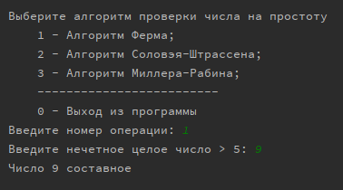
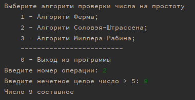

---
# Front matter
title: "Математические основы защиты информации и информационной безопасности. Лабораторная работа №5"
subtitle: "Вероятностные алгоритмы проверки чисел на простоту"
author: |
 Студент: Лесков Данила Валерьевич НФИмд-02-21  
 Преподаватель: Кулябов Дмитрий Сергеевич

# Generic otions
lang: ru-RU
toc-title: "Содержание"

# Bibliography
bibliography: bib/cite.bib
csl: pandoc/csl/gost-r-7-0-5-2008-numeric.csl

# Pdf output format
toc: true # Table of contents
toc_depth: 2
lof: true # List of figures
lot: true # List of tables
fontsize: 12pt
linestretch: 1.5
papersize: a4
documentclass: scrreprt
## I18n
polyglossia-lang:
  name: russian
  options:
	- spelling=modern
	- babelshorthands=true
polyglossia-otherlangs:
  name: english
### Fonts
mainfont: PT Serif
romanfont: PT Serif
sansfont: PT Sans
monofont: PT Mono
mainfontoptions: Ligatures=TeX
romanfontoptions: Ligatures=TeX
sansfontoptions: Ligatures=TeX,Scale=MatchLowercase
monofontoptions: Scale=MatchLowercase,Scale=0.9
## Biblatex
biblatex: true
biblio-style: "gost-numeric"
biblatexoptions:
  - parentracker=true
  - backend=biber
  - hyperref=auto
  - language=auto
  - autolang=other*
  - citestyle=gost-numeric
## Misc options
indent: true
header-includes:
  - \linepenalty=10 # the penalty added to the badness of each line within a paragraph (no associated penalty node) Increasing the value makes tex try to have fewer lines in the paragraph.
  - \interlinepenalty=0 # value of the penalty (node) added after each line of a paragraph.
  - \hyphenpenalty=50 # the penalty for line breaking at an automatically inserted hyphen
  - \exhyphenpenalty=50 # the penalty for line breaking at an explicit hyphen
  - \binoppenalty=700 # the penalty for breaking a line at a binary operator
  - \relpenalty=500 # the penalty for breaking a line at a relation
  - \clubpenalty=150 # extra penalty for breaking after first line of a paragraph
  - \widowpenalty=150 # extra penalty for breaking before last line of a paragraph
  - \displaywidowpenalty=50 # extra penalty for breaking before last line before a display math
  - \brokenpenalty=100 # extra penalty for page breaking after a hyphenated line
  - \predisplaypenalty=10000 # penalty for breaking before a display
  - \postdisplaypenalty=0 # penalty for breaking after a display
  - \floatingpenalty = 20000 # penalty for splitting an insertion (can only be split footnote in standard LaTeX)
  - \raggedbottom # or \flushbottom
  - \usepackage{float} # keep figures where there are in the text
  - \floatplacement{figure}{H} # keep figures where there are in the text
---

# Цель работы

Изучение алгоритмов Ферма, Соловэя-Штрассена, Миллера-Рабина.

# Теоретические сведения

Для построения многих систем защиты информации требуются простые числа большой разрядности. В связи с этим актуальной является задача тестирования на простоту натуральных чисел.

Существует два типа критериев простоты: детерминированные и вероятностные. Детерминированные тесты позволяют доказать, что тестируемое число - простое. Практически применимые детерминированные тесты способны дать положительный ответ не для каждого простого числа, поскольку используют лишь достаточные условия простоты.
Детерминированные тесты более полезны, когда необходимо построить большое простое число, а не проверить простоту, скажем, некоторого единственного числа.
В отличие от детерминированных, вероятностные тесты можно эффективно использовать для тестирования отдельных чисел, однако их результаты, с некоторой вероятностью, могут быть неверными. К счастью, ценой количества повторений теста с модифицированными исходными данными вероятность ошибки можно сделать как угодно малой.
На сегодня известно достаточно много алгоритмов проверки чисел на простоту. Несмотря на то, что большинство из таких алгоритмов имеет субэкспоненциальную оценку сложности, на практике они показывают вполне приемлемую скорость работы.
На практике рассмотренные алгоритмы чаще всего по отдельности не применяются. Для проверки числа на простоту используют либо их комбинации, либо детерминированные тесты на простоту.
Детерминированный алгоритм всегда действует по одной и той же схеме и гарантированно решает поставленную задачу. Вероятностный алгоритм использует генератор случайных чисел и дает не гарантированно точный ответ. Вероятностные алгоритмы в общем случае не менее эффективны, чем детерминированные (если используемый генератор случайных чисел всегда дает набор одних и тех же чисел, возможно, зависящих от входных данных, то вероятностный алгоритм становится детерминированным).

## Тест Ферма

* Вход. Нечетное целое число $n \geq 5$.
* Выход. «Число n, вероятно, простое» или «Число n составное».

1. Выбрать случайное целое число $a, 2 \leq a \leq n-2$.
2. Вычислить $r=a^{n-1} (mod n)$
3. При $r=1$ результат: «Число n, вероятно, простое». В противном случае результат: «Число n составное».

Подробнее об алгоритме: [@fermat]

## Тест Соловэя-Штрассена

* Вход. Нечетное целое число $n \geq 5$.
* Выход. «Число n, вероятно, простое» или «Число n составное».

1. Выбрать случайное целое число $a, 2 \leq a \leq n-2$.
2. Вычислить $r=a^{(\frac{n-1}{2})} (mod n)$
3. При $r \neq 1$ и $r \neq n-1$ результат: «Число n составное».
4. Вычислить символ Якоби $s = (\frac{a}{n})$
5. При $r=s (mod n)$ результат: «Число n, вероятно, простое». В противном случае результат: «Число n составное».

Подробнее об алгоритме: [@ss]

## Тест Миллера-Рабина

* Вход. Нечетное целое число $n \geq 5$.
* Выход. «Число n, вероятно, простое» или «Число n составное».

1. Представить $n-1$ в виде $n-1 = 2^sr$, где r - нечетное число
2. Выбрать случайное целое число $a, 2 \leq a \leq n-2$.
3. Вычислить $y=a^r (mod n)$
4. При $y \neq 1$ и $y \neq n-1$ выполнить действия
	- Положить $j=1$
	- Если $j \leq s-1$ и $y \neq n-1$ то
		* Положить $y=y^2 (mod n)$
		* При $y=1$   результат: «Число n составное».
		* Положить $j=j+1$
	- При $y \neq n-1$ результат: «Число n составное».
5. Результат: «Число n, вероятно, простое».

Подробнее об алгоритме: [@mr]

# Выполнение работы

## Реализация алгоритмов

```
import random


def fermat(n):
    a = random.randint(2, n - 2)
    r = a ** (n - 1) % n
    return r == 1


def jacoby(a, n):
    if (a == 0):
        return 0
    result = 1
    if (a < 0):
        a = -a
        if (n % 4 == 3):
            result = -result
    if (a == 1):
        return result
    while (a):
        if (a < 0):
            a = -a
            if (n % 4 == 3):
                result = -result
        while (a % 2 == 0):
            a = a // 2
            if (n % 8 == 3 or n % 8 == 5):
                result = -result
        a, n = n, a
        if (a % 4 == 3 and n % 4 == 3):
            result = -result
        a = a % n
        if (a > (n // 2)):
            a = a - n
    if (n == 1):
        return result
    return 0


def solovay_strassen(n):
    a = random.randint(2, n - 2)
    r = a ** ((n - 1) / 2)
    if (r != 1 and r != (n - 1)):
        return False
    s = jacoby(a, n)
    return not ((r - s) % n == 0)


def miller_rabin(n):
    a = random.randint(2, n - 2)
    d = n - 1
    s = 0
    while (d % 2 == 0):
        s = s + 1
        d = int(d / 2)
    x = a ** d
    x = x % n
    if (x == 1 or x == (n - 1)):
        return True
    r = 1
    while (r < (s - 1)):
        x = x ** 2
        x = x % n
        if (x == 1):
            return False
        if (x == (n - 1)):
            return True
    return False


if __name__ == '__main__':
    while True:
        try:
            result_code = int(input(
                """
Выберите алгоритм проверки числа на простоту
    1 - Алгоритм Ферма;
    2 - Алгоритм Соловэя-Штрассена;
    3 - Алгоритм Миллера-Рабина;
    -------------------------
    0 - Выход из программы
Введите номер операции: """
            ))
            if result_code > 3:
                print("Ошибка ввода!")
                continue
            if result_code == 0:
                break
        except:
            print("Ошибка ввода!")
            continue

        try:
            n = int(input("Введите нечетное целое число > 5: "))
        except:
            print("Ошибка ввода!")
            continue

        result = False

        if result_code == 1:
            result = fermat(n)

        if result_code == 2:
            result = solovay_strassen(n)

        if result_code == 3:
            result = miller_rabin(n)

        if result:
            print("Число {}, вероятно, простое".format(n))
        else:
            print("Число {} составное".format(n))

```

## Пример работы алгоритма Ферма

На рис. [-@fig:001] представлены результаты работы алгоритма Ферма: 

{ #fig:001 width=70% height=70%}

## Пример работы алгоритма Соловэя-Штрассена

На рис. [-@fig:002] представлены результаты работы алгоритма Соловэя-Штрассена: 

{ #fig:002 width=70% height=70%}

## Пример работы алгоритма Миллера-Рабина

На рис. [-@fig:003] представлены результаты работы алгоритма Миллера-Рабина: 

{ #fig:003 width=70% height=70%}

# Выводы

В ходе выполнения работы были успешно изучены алгоритмы Ферма, Соловэя-Штрассена, Миллера-Рабина, а также реализованы данные алгоритмы программно на языке Python.

# Список литературы{.unnumbered}

::: {#refs}
:::